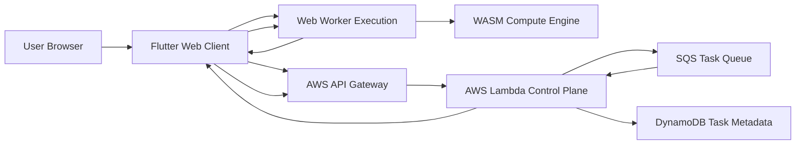

# OptiMesh

**Opt-in distributed browser compute platform built with Flutter Web, Web Workers, WebAssembly, and AWS serverless.**

OptiMesh is an experimental platform exploring how modern browsers can participate in **transparent, user-consented distributed computing networks**.

Instead of hidden background mining or opaque resource usage, OptiMesh is designed around:

- explicit user participation
- bounded workloads
- transparent compute usage
- platform-level visibility and control

This repository is being developed as a **systems architecture portfolio project** demonstrating distributed platform design, browser compute execution, serverless infrastructure, and ethical distributed computing models.

---

# Why OptiMesh Exists

Modern browsers are powerful compute environments capable of performing meaningful workloads.

However, most distributed browser compute platforms historically relied on:

- hidden background mining
- non-consensual compute usage
- opaque execution models

OptiMesh explores a different model where users can **voluntarily contribute idle browser compute** toward useful workloads.

Possible workloads include:

- simulation tasks
- analytics workloads
- deterministic research computations
- distributed benchmarking
- controlled AI inference batches

The core focus of this project is **architecture clarity and ethical design**, not stealth compute.

---

# High-Level Architecture

OptiMesh is composed of four primary layers.

## 1. Browser Client (Flutter Web)

The browser client provides the user interface and controls participation in the OptiMesh network.

Responsibilities include:

- participation opt-in / opt-out
- workload visibility
- compute activity display
- node registration
- communication with the control plane

Technologies:

- Flutter Web
- Dart
- Web Workers
- browser storage

---

## 2. Execution Layer

Workloads run safely inside the browser using isolated execution environments.

Responsibilities include:

- background compute execution
- task lifecycle management
- resource constraints
- safe interruption

Technologies:

- Web Workers
- WebAssembly
- sandboxed compute tasks

---

## 3. Control Plane (AWS Serverless)

The control plane coordinates participating nodes and distributes workloads.

Responsibilities include:

- node registration
- task assignment
- workload coordination
- result collection
- task state tracking

Planned infrastructure:

- AWS API Gateway
- AWS Lambda
- DynamoDB
- SQS
- CloudWatch

---

## 4. Verification & Rewards Layer

Distributed workloads require trust mechanisms to ensure returned results are valid.

Possible approaches include:

- redundant task execution
- probabilistic verification
- deterministic workload validation

Future versions may explore reward models such as:

- compute credits
- contribution scoring
- tokenized incentives

---

## System Architecture Diagram


# Project Documentation

Detailed documentation is located in the `docs/` directory.

Architecture and planning documents include:

- **Architecture Overview** — `docs/architecture.md`
- **System Overview** — `docs/system-overview.md`
- **Architecture Diagram Notes** — `docs/architecture-diagram.md`
- **Development Roadmap** — `docs/roadmap.md`

Backend platform planning:

- **AWS Control Plane Overview** — `infra/aws/README.md`
- **API Contract (Draft)** — `infra/aws/api-contract.md`

---

# Repository Structure

```
optimesh/

docs/
  architecture.md
  system-overview.md
  architecture-diagram.md
  roadmap.md

frontend/
  flutter_web/
    README.md
    pubspec.yaml
    lib/main.dart

wasm/
  engine/
    README.md
    Cargo.toml
    src/lib.rs

infra/
  aws/
    README.md
    architecture-notes.md
    api-contract.md

scripts/
```

---

# Development Roadmap

The project will be implemented incrementally.

## Phase 1 — Repository Foundation
- public GitHub repository
- architecture documentation
- roadmap documentation
- project structure

## Phase 2 — Browser Client
- Flutter Web interface
- participation controls
- compute status display

## Phase 3 — Execution Engine
- Web Worker compute tasks
- task lifecycle control
- bounded execution model

## Phase 4 — WebAssembly Integration
- high-performance compute modules
- worker + WASM execution flow
- deterministic sample workloads

## Phase 5 — AWS Control Plane
- node registration
- workload assignment endpoints
- result submission
- DynamoDB task metadata

## Phase 6 — Verification Layer
- deterministic validation tasks
- duplicate execution strategy
- result acceptance logic

## Phase 7 — Portfolio Demonstration
- architecture diagrams
- screenshots
- example workloads
- implementation notes

---

# Ethical Design

OptiMesh is intentionally designed to avoid problematic practices commonly associated with browser compute platforms.

This project explicitly avoids:

- hidden crypto mining
- non-consensual compute usage
- background execution without visibility
- opaque compute activity

Participation must always remain **transparent and user-controlled**.

---

# Project Status

Current project status is tracked in:

`PROJECT_STATUS.md`

The repository currently includes:

- architecture documentation
- development roadmap
- frontend shell
- WebAssembly engine scaffold
- AWS control plane planning
- API contract draft

Implementation will proceed incrementally.

---

# Contributing

Contribution guidelines can be found in:

`CONTRIBUTING.md`

At the moment, the project is primarily being developed by the repository author while the architecture stabilizes.

---

# Changelog

Project change history is tracked in:

`CHANGELOG.md`

---

# Author

Jason Leggett  
Software Engineer / Engineering Leader

Areas of focus across my work include:

- distributed systems
- platform architecture
- Flutter applications
- AWS serverless infrastructure
- browser compute platforms
- AI / ML systems

---

# License

MIT License
