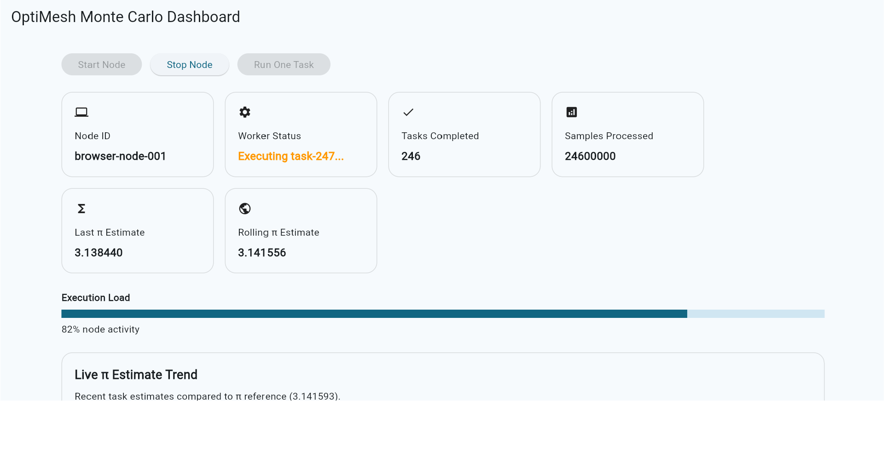

# OptiMesh


**Opt-in distributed browser compute platform**


  
  


OptiMesh is a portfolio project demonstrating how browser clients can participate in distributed compute workloads using modern web technologies.

The project explores how lightweight browser nodes can register with a control plane, fetch bounded workloads, execute them in a Web Worker, and return results — all while maintaining transparency and user control.

This repository showcases an experimental distributed compute architecture built with:

- Flutter Web  
- Web Workers  
- Monte Carlo workloads  
- Simulated control plane  
- Serverless-ready architecture patterns  

The goal is to explore **ethical, opt-in distributed compute** rather than hidden or exploitative browser mining.

---

## 🚀 Live Demo Features

The current demo simulates a **browser compute node dashboard**.

Users can start a node, process workloads, and observe how tasks contribute to a rolling distributed result.

### Node Simulation

The browser acts as a compute node that can:

- Register with a control plane  
- Fetch compute tasks  
- Execute workloads in a Web Worker  
- Submit results back to the control plane  

### Continuous Task Execution

When the node is started:

- Workloads execute continuously  
- Tasks are processed sequentially  
- Results are submitted automatically  

### Monte Carlo Distributed Simulation

Each task performs a Monte Carlo simulation estimating π.

The dashboard shows:

- Samples processed  
- Last task estimate  
- Rolling π estimate across tasks  
- Task history with timestamps  

### 📈 Live Estimate Trend Chart

The dashboard includes a real-time chart showing:

- Recent task estimates  
- Convergence toward π  
- Reference line for the true value of π  

This demonstrates how distributed tasks contribute to a **rolling aggregate result**.

### Activity Feed

The dashboard logs key events such as:

- Node registration  
- Task fetch  
- Task execution  
- Result submission  
- Result acceptance  

### Worker Isolation

All compute tasks run inside a **Web Worker** so that:

- The UI remains responsive  
- Workloads are isolated from the main thread  

---

## 🧠 Architecture Overview

OptiMesh follows a simplified distributed compute architecture.

### Browser Node

- Flutter Web UI  
- Web Worker execution engine  
- Node status and telemetry dashboard  

### Control Plane (Simulated)

- Node registration  
- Task assignment  
- Result acceptance  

### Compute Engine

- Bounded workloads  
- Monte Carlo simulation tasks  
- Sandboxed execution  

The architecture is designed so the control plane can later be replaced with a **real serverless backend**.

---

## 🛠 Technology Stack

### Frontend

- Flutter Web  
- Dart  

### Compute Execution

- Web Workers  
- JavaScript worker runtime  

### Architecture

- Distributed task model  
- Control-plane simulation  
- Bounded compute workloads  

---

## 🎯 Why This Project Exists

Many browser-based compute systems historically relied on:

- Hidden mining scripts  
- Non-transparent workloads  

OptiMesh explores a different model:

- Opt-in compute participation  
- Transparent workloads  
- Bounded execution time  
- Visible telemetry for the user  

The goal is to demonstrate how browser compute can be designed **ethically and transparently**.

---

## 📁 Repository Structure

```bash
optimesh/
│
├ docs/
│ ├ architecture.md
│ └ roadmap.md
│
├ frontend/
│ └ flutter_web/
│
├ wasm/
│ └ engine/
│
├ infra/
│ └ aws/
│
└ scripts/
